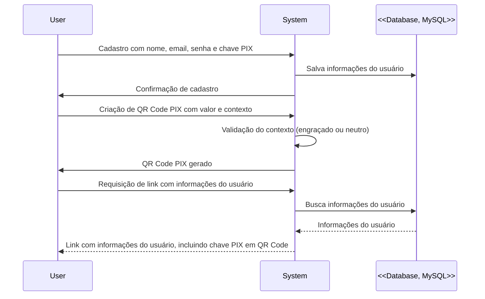

# Sistema PHP de Gerenciamento de Usuários com QR Code PIX
 
Domínio indisponível por encerramento da 000webhost.


Este é um sistema desenvolvido em PHP para gerenciar usuários e permitir a criação de QR Code PIX com diferentes contextos.

## Funcionalidades

- Cadastro de usuários com nome, email, senha e chave PIX.
- Criação de QR Code PIX com valor desejado e contexto (engraçado ou neutro).
- Validação do contexto durante o cadastro do usuário.
- Geração de um link com o QR Code PIX requisitado pelo usuário.

## Requisitos

- PHP >= 7.0
- Servidor web (Apache, Nginx, etc.)
- Banco de dados MySQL

## Instalação

1. Clone este repositório para o seu servidor web:

```bash
git clone https://github.com/pedr-moura/PatoPay.git
```

2. Configure o servidor web para apontar para a pasta do projeto.

3. Importe o arquivo SQL fornecido (`database.sql`) para criar a estrutura do banco de dados.

4. Configure as credenciais do banco de dados no arquivo `config.php`.

5. Certifique-se de que o PHP GD Library está habilitado para a geração de QR Codes.

## Uso

1. Acesse o sistema através do seu navegador.

2. Faça o cadastro de um novo usuário informando nome, email, senha e chave PIX.

3. Após o cadastro, você poderá criar um QR Code PIX na seção correspondente.

4. Escolha o valor desejado para o QR Code PIX.

5. Confirme a criação do QR Code PIX.

6. Após a confirmação, um link será gerado com o QR Code PIX requisitado.

## Diagrama de Arquitetura



## Estrutura do Banco de Dados

Certifique-se de que o banco de dados MySQL tenha uma tabela com as seguintes colunas:

- `id` (int): ID único do usuário (autoincrementado).
- `email` (varchar): Email do usuário.
- `name` (varchar): Nome do usuário.
- `password` (varchar): Senha do usuário.
- `count_pays` (int): Contador de pagamentos criados pelo usuário.
- `date_register` (datetime): Data e hora de registro do usuário.
- `pix_key` (varchar): Chave PIX do usuário.
- `theme` (varchar): Tema da aplicação.
- `humor` (varchar): Humor do contexto para consulta e adição dos comentários.
- `api_key` (varchar): Chave de API para autenticação de usuário.

Certifique-se de que essas colunas estejam corretamente configuradas no seu banco de dados para que o sistema funcione adequadamente.

## API de Criação de Code PIX

Este sistema possui uma API que permite a criação de Codes PIX para cobranças. Você pode usar esta API para gerar links de pagamento PIX diretamente a partir de outras aplicações ou serviços.

### Endpoint da API:

[https://patopay.000webhostapp.com/home/cobrar/createPay/api/](https://patopay.000webhostapp.com/home/cobrar/createPay/api/)

### Parâmetros:

- `api_key` (obrigatório): Chave de API encontrada no cadastro do usuário.
- `payname` (obrigatório): Nome da pessoa a quem o pagamento será destinado.
- `payvalue` (obrigatório): Valor do pagamento a ser feito.
- `cobrancaSorteada` (opcional): Substitui o texto gerado pelo sistema.

### Exemplo de Uso:

Para criar um QR Code PIX para uma cobrança de Pedro no valor de R$ 100,00, você pode fazer uma requisição para:

GET https://patopay.000webhostapp.com/home/cobrar/createPay/api/?api_key=4pQHqExD&payname=Pedro&payvalue=100&cobrancaSorteada=seu+texto+aqui

Isso retornará uma página pronta que pode ser exibida a qualquer pessoa, mesmo que não tenha cadastro ou sessão ativa no sistema.


### Endpoint da API (json):

[https://patopay.000webhostapp.com/home/cobrar/createPay/api/json/](https://patopay.000webhostapp.com/home/cobrar/createPay/api/json/)

### Parâmetros:

- `api_key` (obrigatório): Chave de API encontrada no cadastro do usuário.
- `payvalue` (obrigatório): Valor do pagamento a ser feito.

### Exemplo de Uso:

Para criar um Code PIX para uma cobrança de Pedro no valor de R$ 100,00, você pode fazer uma requisição para:

GET https://patopay.000webhostapp.com/home/cobrar/createPay/api/json/?api_key=4pQHqExD&payvalue=100

Isso retornará uma estrutura Json com o código pix.


### Observação:

Certifique-se de que sua aplicação possa lidar com a resposta HTML ou JSON retornada pela API e que consiga exibir a página de pagamento PIX adequadamente.
